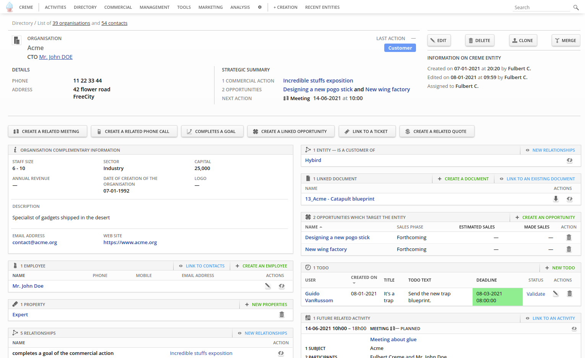

Creme is a free/open-source Customer Relationship Management software developed by Hybird (www.hybird.org).

It is designed with an entities/relationships architecture, and is highly configurable, which allows
adapting Creme to many workflows.



It provides apps (ie: modules) to manage:
 - Contacts & organisations.
 - Documents & folders.
 - Activities (meetings, phone calls, tasks...) with a calendar.
 - Products & services.
 - Invoices, quotes, sales orders & credit notes.
 - Opportunities.
 - Commercial actions.
 - Email campaigns.
 - Reports.
 - Tickets.
 - Alerts, todos & memos.
 - Geolocation.
 - ...

Lots of aspects can be configured through a graphical interface :
 - Detailed views for entities are built from blocks ; you can configure which blocks are
   displayed, you can create your own the blocks (chose the fields which are used)...
 - You can configure the columns of the list views (columns can be related to fields, custom-fields,
   relationships...), and filter the lines with powerful rules.
 - You can create your custom-fields, or hide existing fields.
 - You can choose which fields of forms are used, and group them like you want.
 - You can create your own types of relationship, adapted to your business.
 - ...

Creme has powerful tools to filter, search or import data. it provides a credential system with
some cool features (teams, allow/forbid entities from a filter on fields/relationships, ...).

If you have very specific needs, Creme can also be used as a CRM framework to code your own CRM.

Creme is coded in Python, and uses the Django web framework (http://www.djangoproject.com/) and
the JQuery javascript library (http://jquery.com/).

You can find more information on Creme on its official website: http://cremecrm.com/
You can ask your questions in our forum: https://www.cremecrm.com/forum/index.php
(there is an english section)

### Current translations

 - English (could probably be improved)
 - French


### Recommendations:

It's recommended to use a database engine which supports transactions :
 - PostGreSQL is probably the best choice for data-bases with 100,000+ entities.
 - SQLite support is principally done for developers, but it remains a solution
   for small data-bases (eg: a use as mono-user app with the server running of your computer).

You probably should use 'virtualenv' (for an upgrade from Creme 2.1, you should create a new
virtual env, in order to keep the old one working).


### Dependencies

 - Python 3.6+
 - MySQL 5.7+ or PostGreSQL 9.5+ (or SQLite which is included with Python)
 - A web server compatible with Python, like Apache 2.4
 - Redis 3+
 - Java >= 1.4 (only needed to build the compressed version of CSS and JavaScript files at installation time)
 - These python packages :
   (exact versions of Python packages are indicated in the 'setup.cfg' file)
   - Mandatory :
     - Django 2.2
     - redis 3.4
     - python-dateutil 2.8
     - bleach 4.1
     - Pillow 8.4
     - django-formtools 2.2
     - xlrd (to import contacts, organisations, activities, tickets... from xls files)
     - xlwt (to export all types of entities -- like contacts or organisations -- as xls files)
   - Optional :
     - creme.billing :
       If you want PDF export, you can use :
       - xhtml2pdf (default)
       - weasyprint (easy to install on Linux ; harder on Windows)
       - you can also use the binary "pdflatex" (Ubuntu package 'texlive-latex-base').
     - creme.graphs :
       - pygraphviz 1.5 (seems unavailable on Windows -- you'll need 'graphviz' too)
     - creme.crudity :
       - lcab (if you want Infopath forms export, and your server doesn't run on Windows)

Installation with 'pip':
 - You should probably use "virtualenv" (on a Python >= 3.6).
 - Creme should be installed using 'pip install -e .'
 - About DB server :
   - If you use MySQL, you must add the 'mysql' flag:
     'pip install -e .[mysql]'
   - For PostGreSQL, use 'pip install -e .[pgsql]' instead.
   - SQLite doesn't require a specific flag (see RECOMMENDATIONS).
 - Notice some of these python packages need system libraries to be installed.
   For example, here a list of Debian/Ubuntu packages you'll have to install before:
   - python-dev
   - mysql_config & libmysqlclient-dev (or libpq-dev if you want to use PostGreSQL)
   - redis-server
   - libxslt1-dev
   - default-jre
   - libjpeg-dev
   - graphviz & graphviz-dev (if you want the optional app 'graphs')


### Install

Global remarks:
 - You should know how to install/deploy a Django application.
 - Upgrade note: if you already have a Creme installation, upgrade the version one by one
   (eg: do not try to upgrade from 2.0 to 2.2, upgrade to 2.1 and then 2.2).

Database configuration:
For a new install, you have to create a new database & a new DB user (who is allowed to create/drop tables, indices...).
For an upgrade from the previous major version, duplicate your existing DB (and backup 'creme/media/upload').

Settings:
See the file creme/settings.py and set your parameters in a new file called 'creme/local_settings.py'.
Here the minimal information you must fill :

```python
# -*- coding: utf-8 -*-

DATABASES = {
    'default': {
        'ENGINE':   'django.db.backends.mysql',  # NB: 'django.db.backends.postgresql' for PGSQL
        'NAME':     'name_of_your_db',           # <== TO BE REPLACED
        'USER':     'name_of_your_user',         # <== TO BE REPLACED
        'PASSWORD': 'password_of_the_user',      # <== TO BE REPLACED
        'HOST':     '',                          # Leave empty for localhost.
        'PORT':     '',                          # Leave empty for default port.
    },
}

# SECRET_KEY = ''  # <== TO BE FILLED & UN-COMMENTED (see below).
LANGUAGE_CODE = 'en'  # Also available : 'fr'
TIME_ZONE = 'Europe/Paris'  # See http://en.wikipedia.org/wiki/List_of_tz_zones_by_name
```

To generate the value of SECRET_KEY, run the following command in the root directory & copy its result:
```sh
>> python creme/manage.py build_secret_key
 ```

You can choose precisely the Creme apps you want, by copying INSTALLED_CREME_APPS & commenting the unwanted apps.
Beware: comment only app which are in the 'optional' section, & respect the dependencies which are indicated.

The information from the section "EMAILS [internal]" of 'settings.py' should be overridden in
your 'local_settings.py' if you want that your users receive e-mails from Creme (ToDos, Alerts...).
Information can be filled/changed later.

For an upgrade from the previous version of Creme :
 - Copy the file local_settings.py of your existing installation :
   - do not forget to change NAME in order to use your duplicated DB.
   - do not remove apps in INSTALLED_CREME_APPS now (because they are installed in your DB) ;
     complete your installation & then un-install apps you do not want anymore (see below).
 - Copy the sub-folders (& their content of course) of the folder creme/media/upload from your
   existing installation to the one of your new install (if you did not use the app documents your may
   have nothing to copy).

Filling the DB tables:
Run the following commands in the root directory:
```sh
>> python creme/manage.py migrate
>> python creme/manage.py generatemedia
>> python creme/manage.py creme_populate
```

If you are upgrading the version, clean all existing sessions, for example like this:
```sh
>> python creme/manage.py shell
> from django.contrib.sessions.models import Session
> Session.objects.all().delete()
```

Note for MySQL users: you should load the time zone tables.
 - On Unix servers, it can be done with:
   ```sh
   >> mysql_tzinfo_to_sql /usr/share/zoneinfo | mysql -u root -p mysql
   ```
 - For Windows environment, see https://stackoverflow.com/questions/14454304/convert-tz-returns-null


### Launch

To run the development server, you just have to run this command:
```sh
>> python creme/manage.py runserver
```
You can then go to http://localhost:8000 & log in with root/root.

For a production deployment (Apache, Nginx...), you should read https://docs.djangoproject.com/en/2.2/howto/deployment/

In order to use the job system (eg: sending emails campaign, CSV import...), run the job manager too:
```sh
>> python creme/manage.py creme_job_manager
```


### Uninstall apps

When you have a working installation, & want to remove an (optional) app, use the command 'creme_uninstall' which will
clean the DB. When it's done, you can comment the app in local_settings.py


### Contributing

The repository is using CircleCI and launch some linting tests. To check them locally before any commit or push you can
use the hooks in '.githooks'. There are two ways to configure them:

Simply change git configuration (works with git 2.9+)
```sh
>> git config core.hooksPath .githooks
```

Or create symlink in '.git/hooks/'. Make sure the old one are moved or removed.
```sh
>> ln -s ../../.githooks/pre-commit .git/hooks/pre-commit
>> ln -s ../../.githooks/pre-push .git/hooks/pre-push
```

In order to run the JavaScript linter locally, you can install a NodeJS environment within your virtualenv thanks to the
python package nodeenv. In your virtualenv (named "mycremeenv"):
```sh
>> pip install nodeenv
>> nodeenv -n 12.16.3 -p    # to install nodejs 12.16.3 with "mycremeenv"
>> deactivate
>> workon mycremeenv
>> nodejs --version  # to check the installation is OK
>> make node-update  # Install nodejs requirements
```

Now you can run "make eslint" manually, and the pre-commit hook will check the new/modified files.
