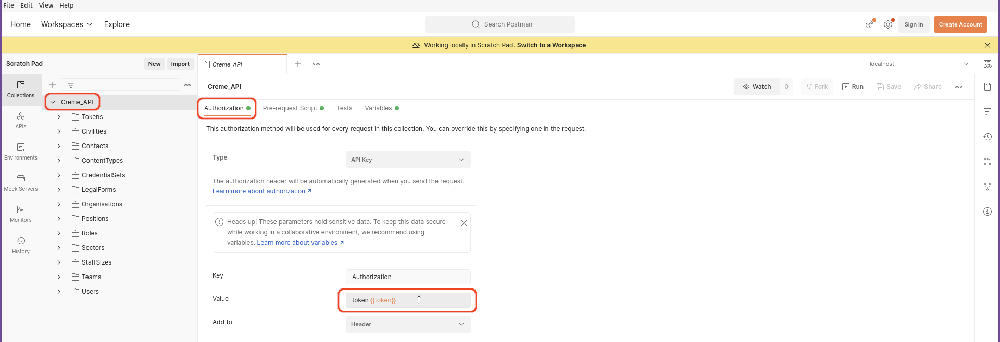

# Overview

This README has the purpose to explain how to setup Postman to use and test our Creme API.
All the screenshots of this README have been done on Postman Version 9.22.2.

This folder contains:

- 'localhost.postman_environment.json', it is the environment file with all the 
environment variables needed to test Creme API locally,
- 'Creme_API.postman_collection.json', it is the Postman collection file.

The Postman collection file contains:

- the definition of all the endpoints of Creme API,
- pre-scripts and test scripts to run automatically tests on all endpoints of Creme API.

# Install and setup

In the following instructions, we will explain to setup your Postman to use Creme API locally.

## Install Postman

First, you need to install Postman on your computer. 
You can use the shop of your system or follow the install instructions of [Postman documentation](https://learning.postman.com/docs/getting-started/installation-and-updates/).

## Import files

After installing Postman, you have to import an environment file and the Postman collection of this folder.

Here are the instruction to import files on Postman. 

- On the top right corner of the left panel, click on 'Import' button.
  
- A popup will appear and click on 'Upload Files'.
- Select an environment file, here 'localhost.postman_environment.json', and the 'Postman Collection', and click on 'Import'.
  
- Now, if you click on 'Collections' on the left pannel, you will see the 'Creme API' folder and if you click on 'Environments', you will see 'localhost' file.
- Finally, you have to specify Postman to use the 'localhost' environment variables, by clicking on the top right corner where it's written 'No Environment' and select 'localhost'.

## Setup API application

For the last setup part, we have to create an API application on Creme and add the credentials in Postman environment variables. Here are the instructions:
- go to your [Creme documentation configuration page](http://127.0.0.1:8000/creme_api/configuration), click on 'new application' button and enter all information in the form to create your API application,
- after saving the form, in the API applications listview, a green popup will appear and you have to note your 'Application ID' and your 'Application Secret'. Watch out this is the only time you will see your 'Application Secret',

- go to your environment file on Postman, add enter your 'Application ID' and your 'Application Secret' in the corresponding variables and click on save.

# Usage

This part will explain you how to call an endpoint of Creme API using Postman and how to run tests.

## Postman collection overview

Before using the Postman collection, this section will explain how the collection is structured.
The collection is organized by entities. In each entity folder you will have all the corresponding available endpoints.

If you click on the main folder 'Creme_API', you will see all the global configuration.
- In the 'authorization' configuration tab, we select the 'API Key' authentification using an API 'token'. All the childen of the directory will use this authentification, except the 'ask_token' endpoint.

- In the 'Pre-request Script' tab, there are all the JS functions and constants used for the testing part and for calling automatically needed ressources of an endpoint. For example, in the screenshot below, you can see the function that will make Postman ask for you a token if needed. The functions starting by an underscore are internal of this pre-request script config, and the functions in the 'utils' dictionary are used in the 'Pre-request Script' and 'Tests' tabs of the children endpoints. You don't have to modify this pre-request script code.

If you click on an entity folder and an endpoint, for example 'Creme_API/Contacts/contact_full_update' you will see:
- In the 'Params' tab, you have the 'Query Params' and the 'Path Variables'. In the example, we need a 'contact_id', the variable is in red because we don't have yet an 'contact_id' variable, you can put by hand an 'id' of your choice or use the 'Contact/contact_create' endpoint to create and automatically populate the variable. 
- in the 'Authorization' tab, you can see that the endpoint inherits from the parent, so it uses the token authentification,
- in the 'Headers' tab, we don't have any specific header,
- in the 'Body' tab, you have an example of body that you can modify to put the information of your choice,
- in the 'Pre-request Script' tab, we have the code that will be run before making the API call. Here it's call the 'prerequest_script_entity_detail_and_updateviews' function for testing, you can check what it does in the 'Pre-request Script' of the 'Creme_API' folder,
- in the 'Tests' tab, we have the code that will be run after making the API call. Here it's call the 'test_entity_updateviews_with_addresses' function for testing, you can check what it does in the 'Pre-request Script' of the 'Creme_API' folder.

## Call an endpoint

You can use directly the endpoint of your choice, but to start the tutorial, we will ask explicitly a token. Here are the instruction:
- Click on the 'token' folder, and choose the endpoint 'ask_token'. In the 'Body' tab, you can see that we pass the body the 'application_id' and 'application_secret' we added in the 'localhost' variables before.
- Click on 'Send'. You will see the response body with the new token in the bottom section of Postman. The 'token' variable will be automatically populate by the received one.

- Click on a folder and the endpoint of your choice, in this example 'Contacts/contact_create'.
- Click on 'Body' tab, and modify the proposed body with the information of your choice.
- Click on 'Send'. You will see the response body in the bottom section. You can also see the sent request by clicking on the "code" button on the left panel.

## Run tests

You can run the tests on all the collection, just one entity or one endpoint.

To run all the tests, here are the instructions:
- click on 'Creme_API' folder then on 'Run' button in the top right corner.

- It will open a 'Runner' tab and click on 'Run Creme_API'.

- When it is done, you will have the result of all tests. 

To run the tests of one entity, click on the folder of the wanted 'entity' and make the same steps as for running all the tests.

To run the test of one endpoint, click on the folder and the wanted endpoint and click on 'Send'. You just have to send the request and the corresponding tests will always be launched.
